

# **Practice Questions**

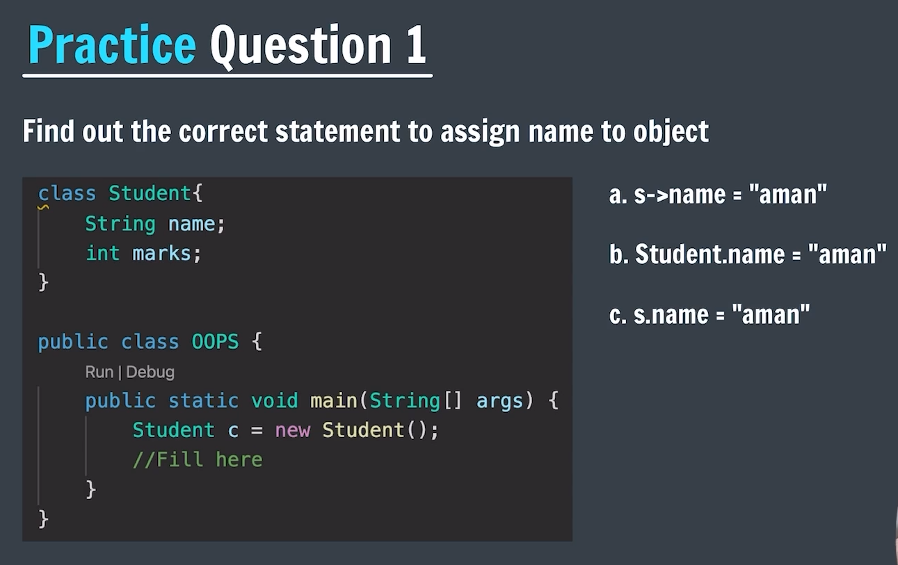

#### Ans : C. s.name = "aman

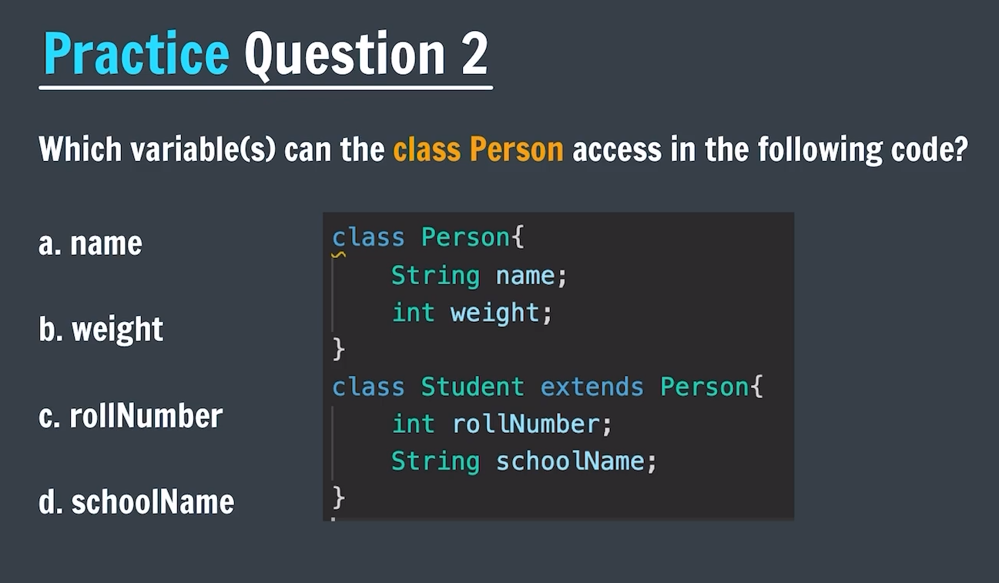

#### Ans : a. name & b. weight

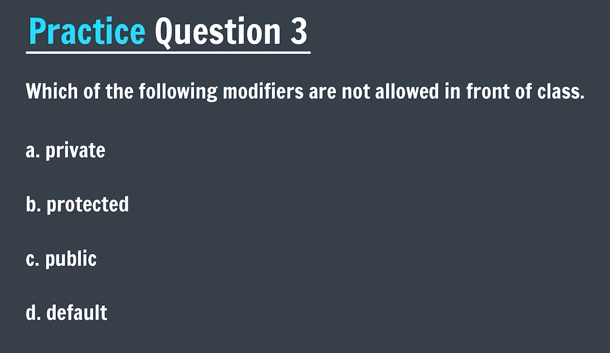

#### Ans : a. private & b. protected

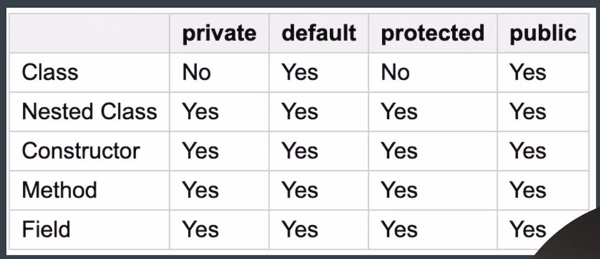

### **Remember^**

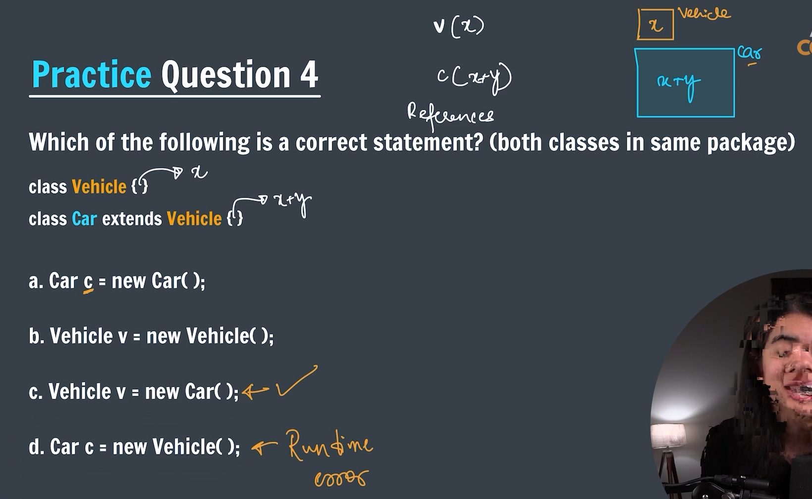

#### Ans : a, b & c are correct statement.

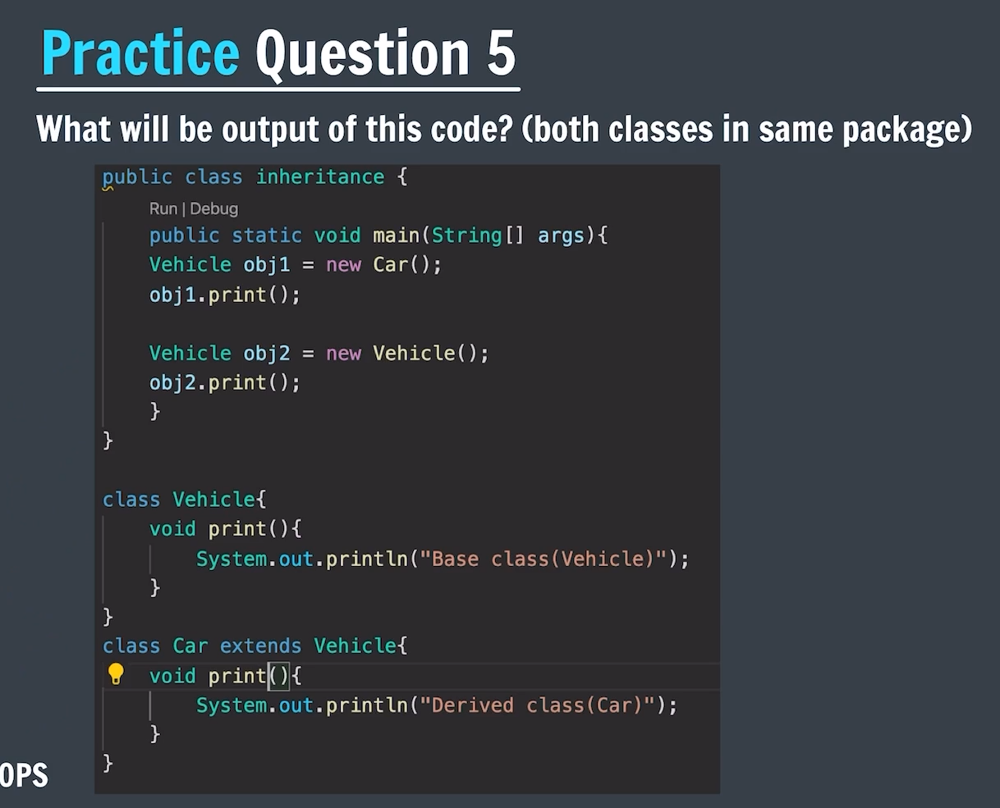

#### Ans : Derived class(Car) /n Base class(Vehicle)

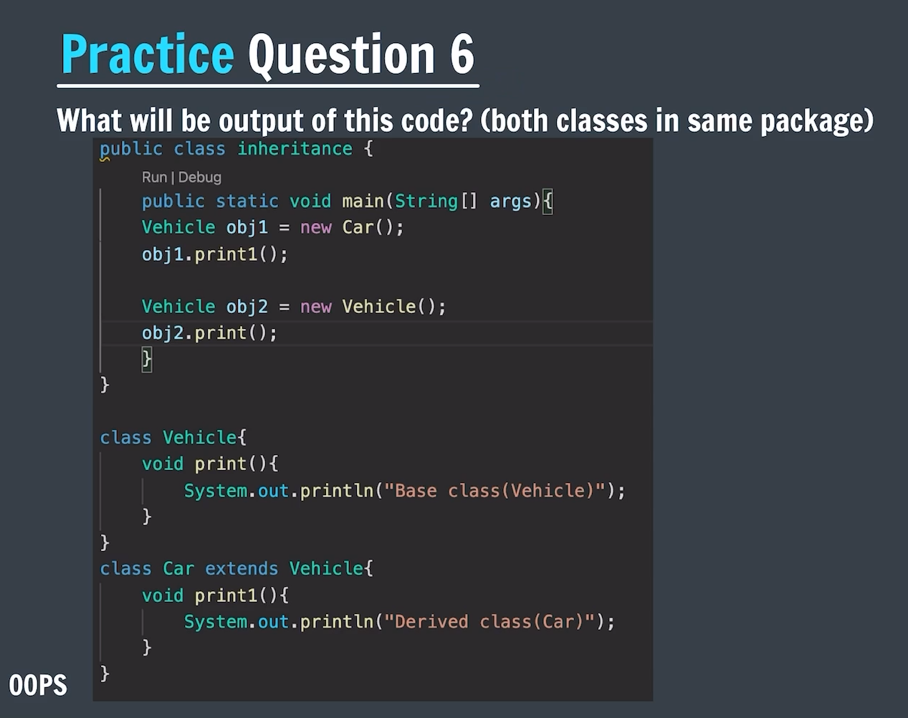

#### Ans : Error

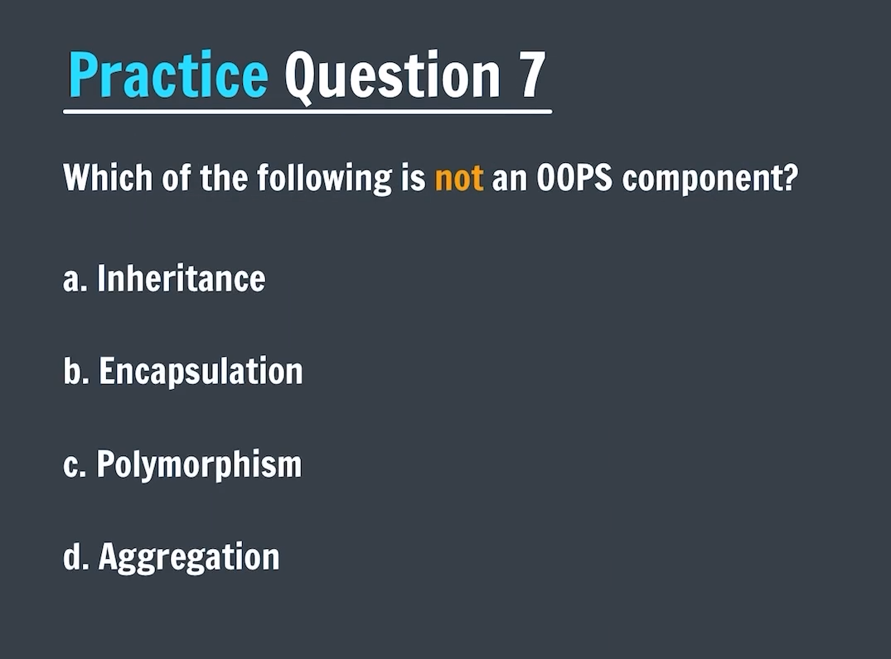

#### Ans : d. Aggregation

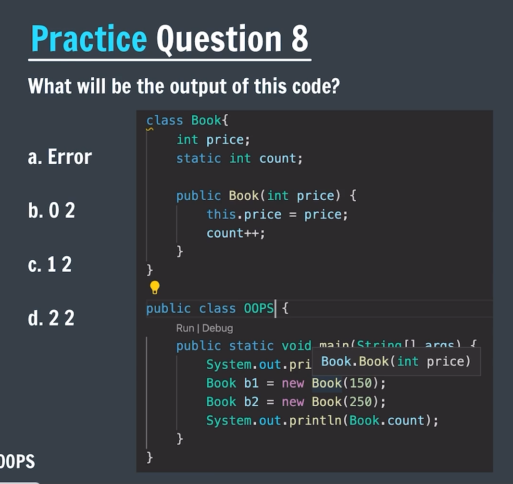

#### Ans : b. 0 2

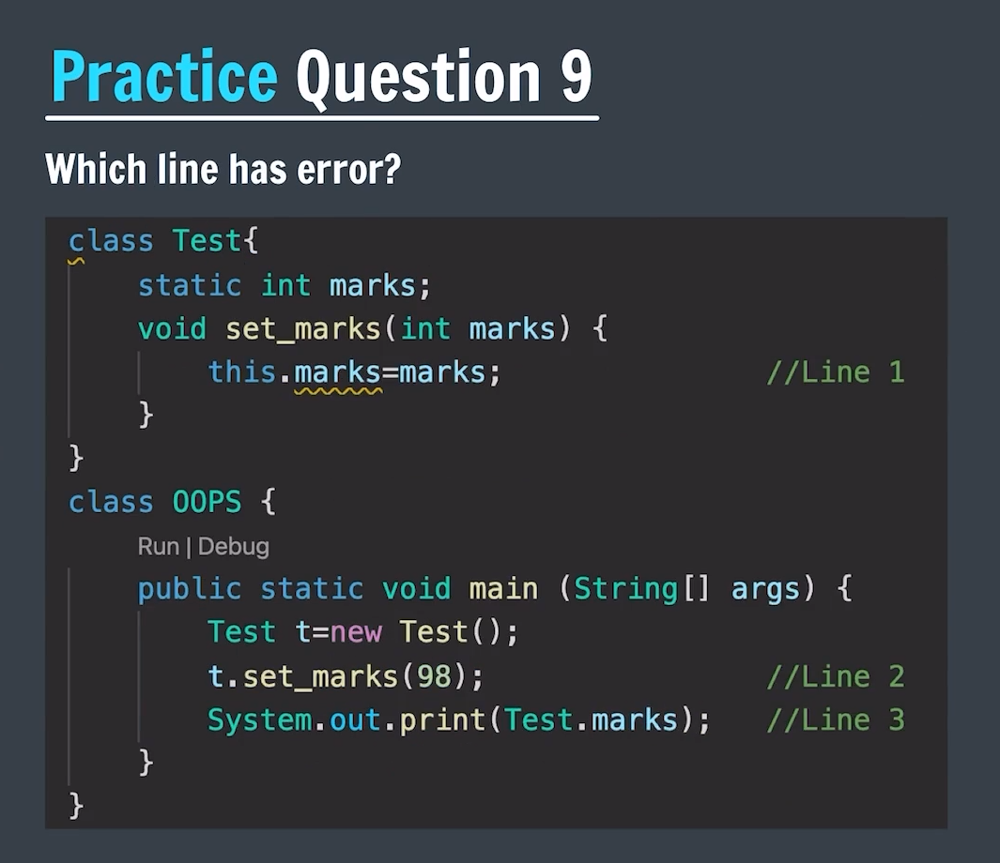

#### Ans : No Error in above code

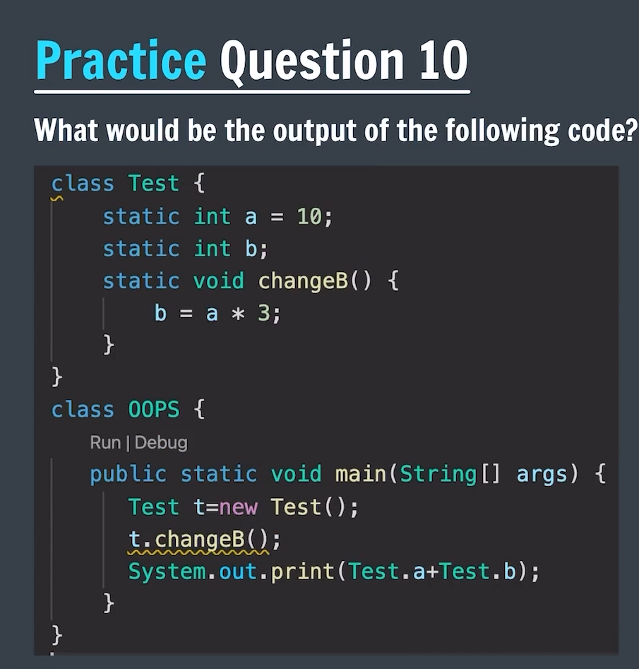

#### Ans : 40

---

