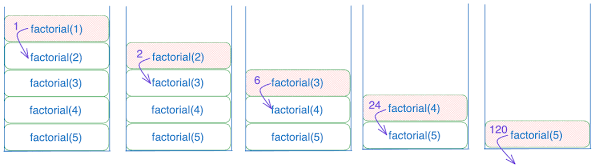
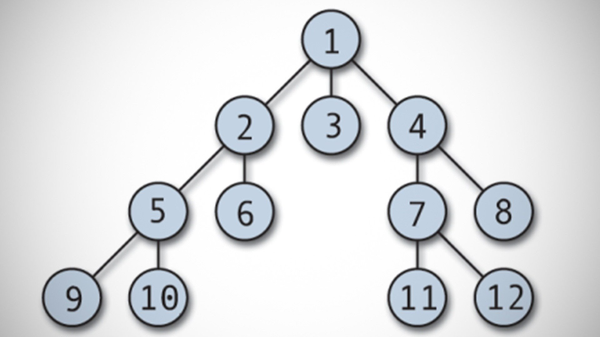

The easiest way to calculate space and time complexity for recursive functions is by drawing a **Recursion Tree**. Once you visualize how the function branches out and how deep it goes, the math becomes straightforward.

Here are the two master formulas you need:

* **Time Complexity:** Total Time = (Number of Recursive Calls) × (Work done per call)
* **Space Complexity:** Total Space = (Maximum Depth of the Tree) × (Memory used per call)

Let's break this down into the two most common scenarios you'll encounter.

### Scenario 1: Single Branching (e.g., Factorial)

When a recursive function only calls itself once per execution, the "tree" is just a straight line.

```java
public int factorial(int n) {
    if (n <= 1) return 1;
    return n * factorial(n - 1);
}

```

* **Time Complexity: $O(N)$**
Calling `factorial(5)` calls `factorial(4)`, then `3`, `2`, and `1`. That is $N$ total calls. Since each call just performs a basic multiplication ($O(1)$ work), the total time is exactly $N \times 1 = O(N)$.
* **Space Complexity: $O(N)$**
Space complexity in recursion is determined by the maximum depth of the **call stack**. The computer has to keep the original `factorial(5)` paused in memory while it waits for `factorial(4)` to finish, and so on. Because it goes $N$ levels deep before returning, the space is $O(N)$.



> **Notice how the stack builds up:** The system allocates memory for each function call until it hits the base case, at which point it starts popping them off one by one.

---

### Scenario 2: Multiple Branches (e.g., Fibonacci)

When a function calls itself multiple times, the tree grows exponentially. This is where visualizing it becomes crucial.

```java
public int fibonacci(int n) {
    if (n <= 1) return n;
    return fibonacci(n - 1) + fibonacci(n - 2);
}

```

> **Notice the exponential growth:** Every single call splits into two more calls, creating a massive tree very quickly.

---

* **Time Complexity: $O(2^N)$**
For multiple branches, you can use the **Branching Factor Formula**: $O(\text{Branches}^{\text{Depth}})$.
In the Fibonacci sequence, each call splits into **2** branches. The longest path in the tree goes roughly **$N$** levels deep. Therefore, the total number of calls is roughly $2^N$. Since each call just performs a simple addition ($O(1)$ work), the time complexity is $O(2^N)$.
* **Space Complexity: $O(N)$**
This trips people up! Even though there are $2^N$ total calls, the computer *does not* execute them all at once. It goes down one path completely to the bottom before coming back up. Therefore, the maximum number of paused functions taking up memory at any given time is exactly the height of the tree, which is $N$. Space is $O(N)$.

### The 3-Step Cheat Sheet

When you look at any recursive algorithm, quickly ask yourself these three things:

1. **How much work is done inside the function itself?** (Usually $O(1)$ unless there is a `for` loop inside).
2. **How many branches does each call make?** (Let's call this $b$).
3. **How deep does the tree go?** (Let's call this $d$).

If the work per call is $O(1)$, your shortcuts are:

* **Time = $O(b^d)$**
* **Space = $O(d)$**

> **Key insight:** Space complexity in recursion is rarely exponential, even if time complexity is. Space only cares about the longest single path from the root to a leaf, while time cares about counting every single node in the entire tree.

---
Give example for that shortcut formulas :-

Let’s apply that 3-step cheat sheet to two different Java examples.

Remember the shortcut for when the work inside the function is $O(1)$:

* **Time** = $O(b^d)$
* **Space** = $O(d)$
*(where $b$ is the number of branches per call, and $d$ is the maximum depth of the tree).*

### Example 1: The "Tri-Force" (Exponential Growth)

Imagine an algorithm that explores three different paths at every step, decrementing the input by 1 each time.

```java
public void explorePaths(int n) {
    if (n <= 0) return; // Base case

    System.out.println("Exploring..."); // O(1) work
    
    // Recursive calls
    explorePaths(n - 1); // Branch 1
    explorePaths(n - 1); // Branch 2
    explorePaths(n - 1); // Branch 3
}

```

**The 3-Step Breakdown:**

1. **Work per call:** $O(1)$ (just a simple print statement).
2. **Branches ($b$):** 3 (it calls itself three times).
3. **Depth ($d$):** $N$ (it subtracts 1 each time until it hits 0. If $N = 5$, it goes 5 levels deep).

**The Calculation:**

* **Time Complexity:** $O(b^d) \rightarrow \mathbf{O(3^N)}$
* **Space Complexity:** $O(d) \rightarrow \mathbf{O(N)}$

*Takeaway:* This runs incredibly slowly as $N$ gets larger, but it barely takes up any memory because the computer only explores one deep path at a time.

---

### Example 2: The "Halving" Method (Logarithmic Depth)

Now let's look at the dividing phase of an algorithm like Merge Sort. Instead of subtracting 1, the input size is cut in half at every step.

```java
public void divide(int low, int high) {
    if (low >= high) return; // Base case

    int mid = (low + high) / 2; // O(1) work
    
    // Recursive calls
    divide(low, mid);       // Branch 1 (Left half)
    divide(mid + 1, high);  // Branch 2 (Right half)
}

```

**The 3-Step Breakdown:**

1. **Work per call:** $O(1)$ (just finding the middle index).
2. **Branches ($b$):** 2 (it splits into a left half and right half).
3. **Depth ($d$):** $\log_2(N)$ (Because you are dividing the range by 2 at each step, a range of 16 goes to 8, 4, 2, 1. That takes 4 steps. $\log_2(16) = 4$).

**The Calculation:**

* **Time Complexity:** $O(b^d) \rightarrow O(2^{\log_2(N)})$. Because of how logarithms work, $2^{\log_2(N)}$ simplifies exactly to $N$. So, Time = $\mathbf{O(N)}$.
* **Space Complexity:** $O(d) \rightarrow \mathbf{O(\log N)}$.

*Takeaway:* This is wildly efficient. To process an array of 1,000,000 items, the call stack only goes about 20 levels deep!

